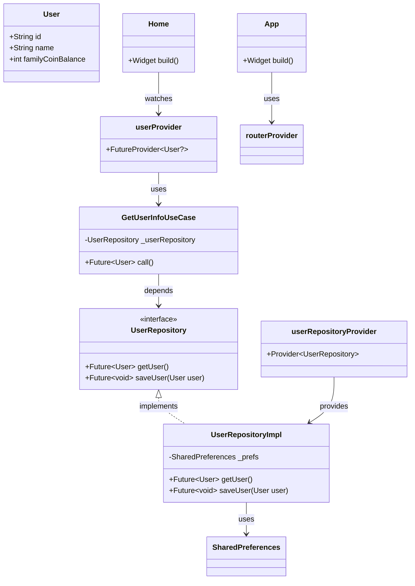

# family_coin_app
FamilyCoinアプリのリポジトリ

```mermaid
classDiagram
    %% Domain層
    class User {
        +String id
        +String name
        +int familyCoinBalance
    }

    class UserRepository {
        <<interface>>
        +Future~User~ getUser()
        +Future~void~ saveUser(User user)
    }

    %% Application層
    class GetUserInfoUseCase {
        -UserRepository _userRepository
        +Future~User~ call()
    }

    %% Infrastructure層
    class UserRepositoryImpl {
        -SharedPreferences _prefs
        +Future~User~ getUser()
        +Future~void~ saveUser(User user)
    }

    %% Presentation層
    class userRepositoryProvider {
        +Provider~UserRepository~
    }

    class userProvider {
        +FutureProvider~User?~
    }

    class App {
        +Widget build()
    }

    class Home {
        +Widget build()
    }

    %% 依存関係
    UserRepository <|.. UserRepositoryImpl : implements
    UserRepositoryImpl --> SharedPreferences : uses
    GetUserInfoUseCase --> UserRepository : depends
    userRepositoryProvider --> UserRepositoryImpl : provides
    userProvider --> GetUserInfoUseCase : uses
    Home --> userProvider : watches
    App --> routerProvider : uses
```