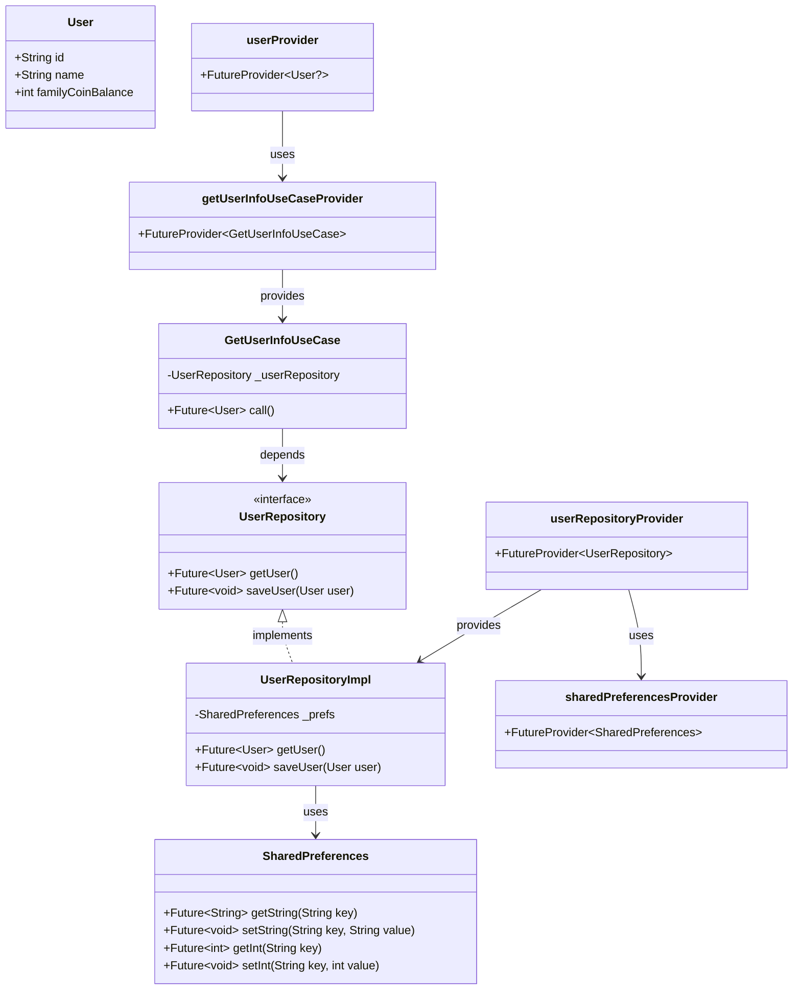

# family_coin_app
FamilyCoinアプリのリポジトリ

```mermaid
classDiagram
    %% Domain層
    class User {
        +String id
        +String name
        +int familyCoinBalance
    }

    class UserRepository {
        <<interface>>
        +Future~User~ getUser()
        +Future~void~ saveUser(User user)
    }

    %% Application層
    class GetUserInfoUseCase {
        -UserRepository _userRepository
        +Future~User~ call()
    }

    %% Infrastructure層
    class UserRepositoryImpl {
        -SharedPreferences _prefs
        +Future~User~ getUser()
        +Future~void~ saveUser(User user)
    }

    class SharedPreferences {
        +Future~String~ getString(String key)
        +Future~void~ setString(String key, String value)
        +Future~int~ getInt(String key)
        +Future~void~ setInt(String key, int value)
    }

    %% Providers
    class sharedPreferencesProvider {
        +FutureProvider~SharedPreferences~
    }

    class userRepositoryProvider {
        +FutureProvider~UserRepository~
    }

    class getUserInfoUseCaseProvider {
        +FutureProvider~GetUserInfoUseCase~
    }

    class userProvider {
        +FutureProvider~User?~
    }

    %% 依存関係
    UserRepository <|.. UserRepositoryImpl : implements
    UserRepositoryImpl --> SharedPreferences : uses
    GetUserInfoUseCase --> UserRepository : depends
    userRepositoryProvider --> UserRepositoryImpl : provides
    getUserInfoUseCaseProvider --> GetUserInfoUseCase : provides
    userProvider --> getUserInfoUseCaseProvider : uses
    userRepositoryProvider --> sharedPreferencesProvider : uses
```